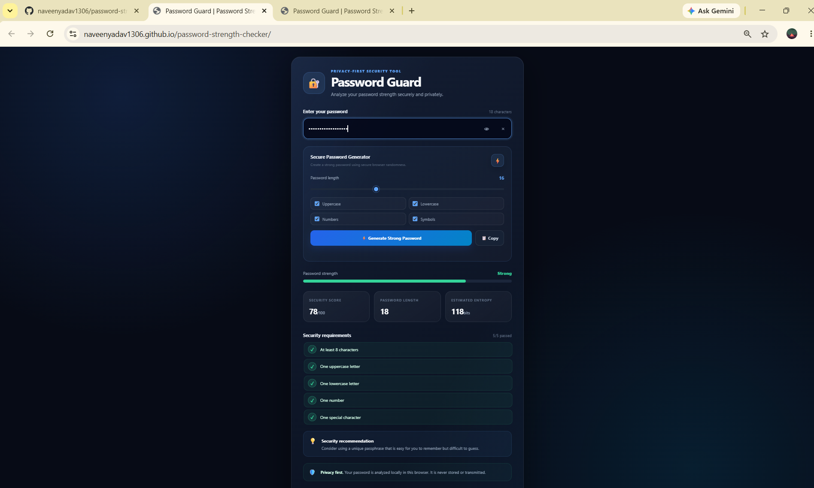

# 🔐 Password Guard

A modern, privacy-first **Password Strength Checker and Secure Password Generator** built with HTML, CSS, and Vanilla JavaScript.

Password Guard analyzes password strength in real time and provides security recommendations without sending the password to a server.

---

## 🌐 Live Demo


🚀 **Live Demo:** https://naveenyadav1306.github.io/password-strength-checker/
## 📸 Project Preview



---

## 📌 Project Overview

Password Guard is a client-side web application designed to help users understand the security of their passwords.

The application provides a real-time security score, password requirements, estimated entropy, security recommendations, and a secure password generator.

The project is designed as an educational cybersecurity project and demonstrates how password analysis can be implemented directly in the browser.

---

## ✨ Features

- 🔢 Real-time password strength score
- 🛡️ Strength classification
- 📊 Security score from 0–100
- 📏 Password length analysis
- 🔐 Estimated password entropy
- ✅ Password requirement checker
- ⚠️ Common password/pattern detection
- 💡 Dynamic security recommendations
- ⚡ Secure password generator
- 🎚️ Password length selector
- 🔠 Uppercase character option
- 🔡 Lowercase character option
- 🔢 Number option
- 🔣 Symbol option
- 📋 Copy generated password
- 👁️ Show/Hide password
- 🧹 Clear password
- 📱 Responsive design
- 🌙 Dark cybersecurity-themed interface
- 🔒 Client-side password analysis

---

## 🧰 Technologies Used

| Technology | Purpose |
|---|---|
| HTML5 | Application structure |
| CSS3 | Styling and responsive UI |
| JavaScript | Password analysis and application logic |
| Web Crypto API | Secure random password generation |
| GitHub | Source code management |

---

## 🔐 Security & Privacy

Password Guard is designed with a **client-side privacy-first approach**.

Passwords entered into the application are analyzed directly inside the browser.

The project does not require:

- A backend server
- A database
- An external password API
- User registration
- Cloud storage

The password generator uses the browser's Web Crypto API instead of `Math.random()` for random character selection.

### Important

This project is an educational password-strength assessment tool. A strength score should not be treated as a guarantee that a password is impossible to crack.

For real-world authentication systems, passwords should be securely hashed and stored using modern password-hashing algorithms such as Argon2id, bcrypt, or scrypt.

---

## 📊 Password Analysis

Password Guard evaluates several characteristics, including:

- Password length
- Uppercase characters
- Lowercase characters
- Numbers
- Special characters
- Repeated characters
- Common patterns
- Character-set diversity
- Estimated entropy

The application combines these signals to provide a user-friendly security score.

---

## ⚡ Secure Password Generator

The built-in password generator allows users to select:

- Password length
- Uppercase letters
- Lowercase letters
- Numbers
- Symbols

The generator uses:

```javascript
crypto.getRandomValues()
